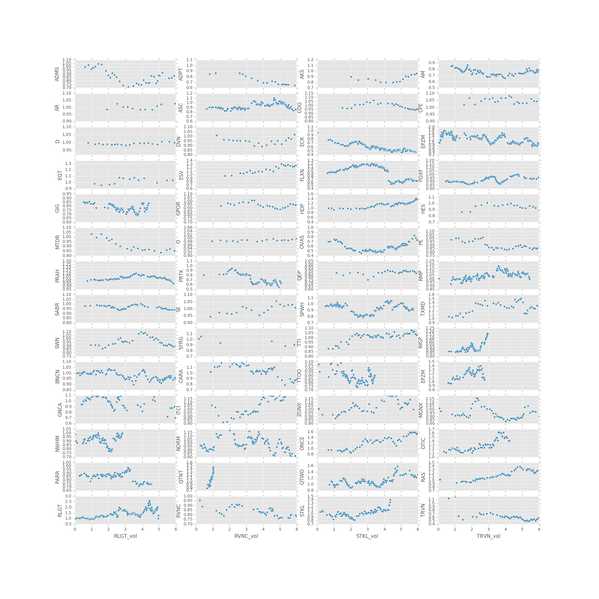
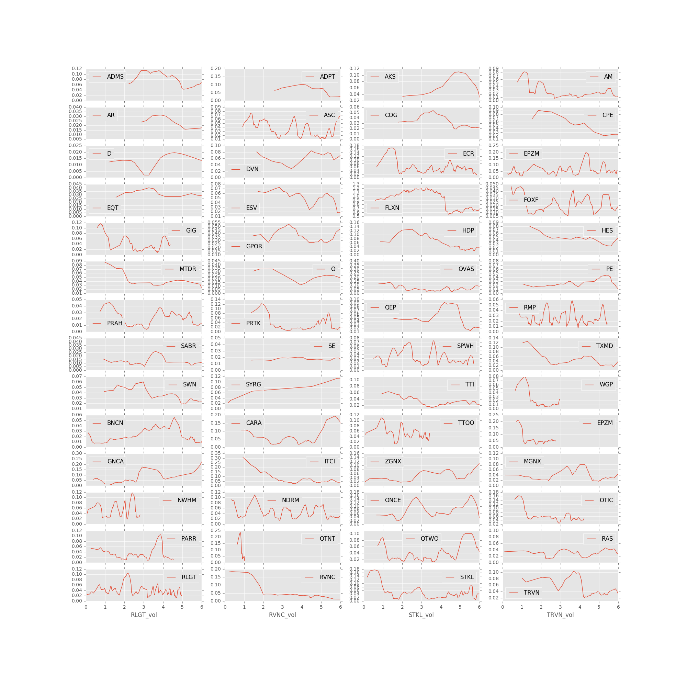
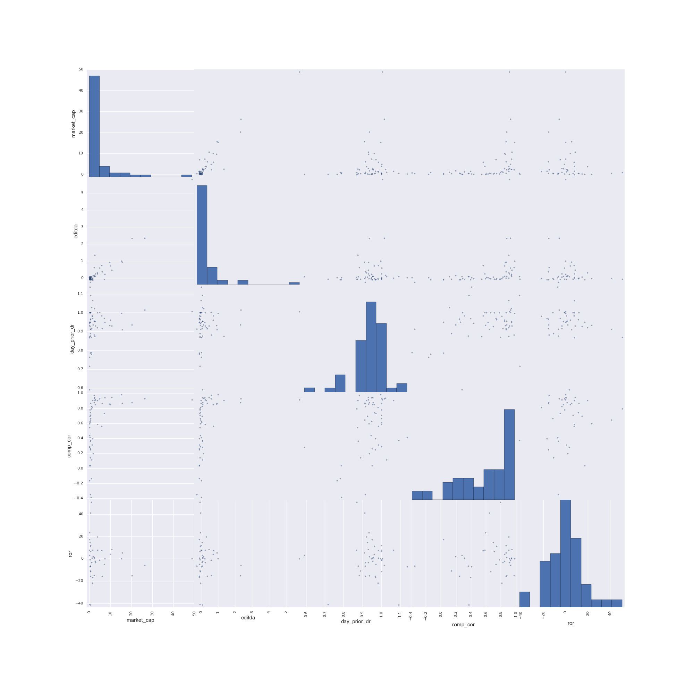
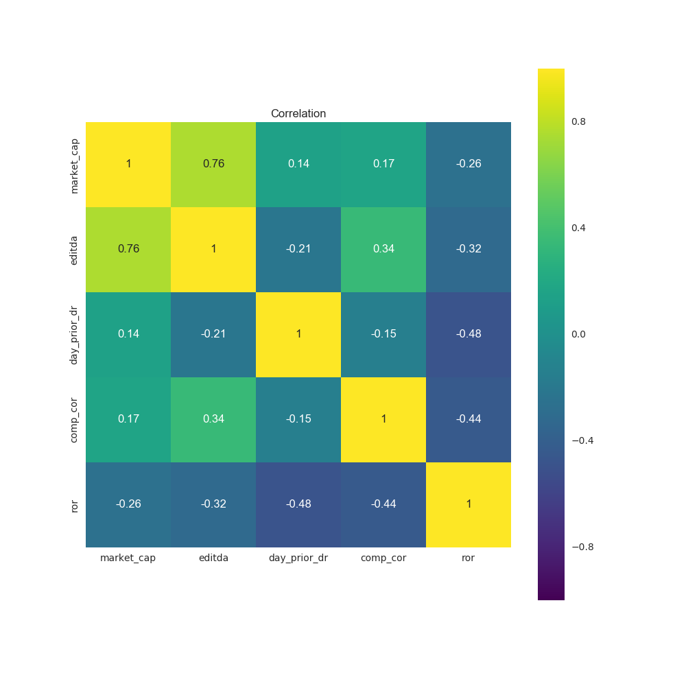
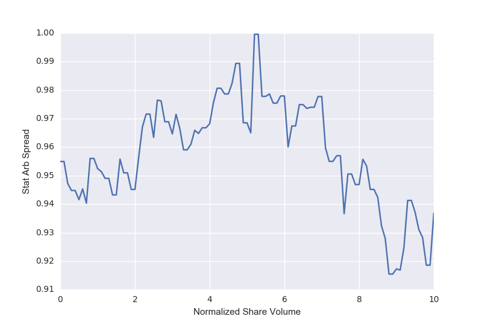

# Regression Project MVP

PART1: EDA
## Goals

To explore particular event-driven investment opportunities within the capital markets with the purposes of determing if any
evident patterns of potential alpha-generating trends exist.

## Approach

I chose to investigate listed (non OTC), U.S. companies where common stocks, for various reasons, suffered a hypothesized technical selloff for which a mean-reversion strategy might possibly capture alpha.

Data Retrieval: Relied primarily upon Yahoo Finance for end of day price and volume data.

Toolset: R for the front end process of evaluating stock pairings and for querying Yahoo finance for stock price and volume data.
Python for balance including uploading the data into Jupyter notebook, performing analysis and writing results to SQLite database.     

Primarily Investigated:
1. Relative value stock price performance (long-short spread) following associated event
2. Volatility for longs following associated event

Investment strategy assumes that investigated longs would be paired with an independantly chosen dollar netural short

## Initial Data Cleaning Approach and Exploratory Findings

I examined 56 random events over the course of a year between July 2015 and June 2016. I first used an R script to download daily stock price data over this period.  I then uploaded the stock prices and volumes in Python and performed analysis to ultimately generate 2 comparison graphs i) Relative Value Price Performance Graph and ii) Long Price Volatility Graph.  For practice, as well as for the benefit of working with more manageable datasets, I dividing the events within 3 separate batches, generating batches 1 & 3 within the Jupyter Notebook that attends this analysis and separately joining batch 2 from an SQLite database.  

I investigated a mean reversion strategy, evaluating correlation and co-integration of each long-short pairing individually (example shown within R script). Post event stock price spread performance was then calculated and graphed relative to normalized share volume since, and for, each event:

### Relative Value Price Performance Graph

I then evaluated rolling, long stock price volatility (10 day standard deviation) against a similiar normalized share volume for each of the 56 events shown below:

### Long Price Volatility Graph

The above graphs are meant to be evaluated as a pair, investigating each stock pairing subplot from the Relative Value Price Performance Graph with its associated Long Price Volatility Graph in order to glean potential relationships.

## Intial Research Findings

1. **Relative Value Price Performance Patterns** - Strictly from exploratory data analysis of an unfilitered event driven dataset, there doesn't seem to be any evident spread behavior that characterizes consistent alpha possibilities. However,
further differentiating performing pairs from the balance of the dataset through filtering and PCA might reveal features which can be employed to drive more consistent investment signals.

2. **Event Long Price Volatility Pattern** - Rolling 10 day volatility seems, in a number of case, to depart from a random walk more often than not collapsing across normalized share volume time.  Substantial diminishment in volatility seem to occassion, and might prove to be a useful feature in future regression analysis for predicting, investment signals (ie. GIG, WGP, EPZM).

## Further Research and Analysis

1. **Domain Specific** - Refine certain stock pairs to strengthen signal / noise within the relative value pairings
2. **Data Science Specific** - Proceed with data analytics, machine learning and regression techniques to build analysis

PART2: Linear Regression
Used linear regression to look at an interesting question related to statistical arbitrage.

## Initial Data Cleaning Approach and Exploratory Findings

I downloaded selected stock prices from Yahoo Finance website using an R script. I then used Python to compile the following features: 'market_cap', 'editda','day_prior_dr','comp_cor' and 'normalized stock volume'.

I relied upon normalized stock volume to investigate investment windows and ultimately chose a particular one from which to establish as my predictor (y) variable.

After cleaning the data, I examined the Scatter Matrix and learned that the variable relationships aren't generally very strong.

### Scatter_Matrix.png

I also investigated correlations among variables which corroborated the above conclusion that factors are weakly correlated to one another.

### Feature_Correlation_Graph

After normalizing price spreads based upon stock trading volume (used Excel), I examined the mean spread ratio for all stocks relative to normalized stock volume.

### Mean_Spread_Ratio

I then established a filter (maskings) function that could be used to further refine the data set based upon particular parameters for each of 'market_cap', 'editda','day_prior_dr' and 'comp_cor'.

I ran a multiple linear regression model with `statsmodels`. The R-squared value was not high (.457) and the p-values inform me that I should probably drop some extraneous variables as I revise my model.

Finally, I loaded the dataset into R in order to determine that the r-squared's matched (they did) and to identify the optimizated linear regression formula (using the 'step' function with direction = 'both' forward and backward).

## Intial Findings

1. **Although a relationship between explanatory and predictor variables may exist, more work needs to be done** - Althgouh the dataset reveals a possible relationship, the fact that the predictor variable (y) was based upon an optimized share volume value, raises the possibility of model overfitting.

2. **Feature Engineering** - 'day_prior_dr' was determined to be the only co-efficient which was statistically significant. Accordingly, substantial improvements could be made identifying and using more powerful features.

## Further Research and Analysis

1. Feature Engineering (mentioned above)
2. Obtain a greater number of sample observations
3. Investigate the variablitiy in investment windows and holding periods
